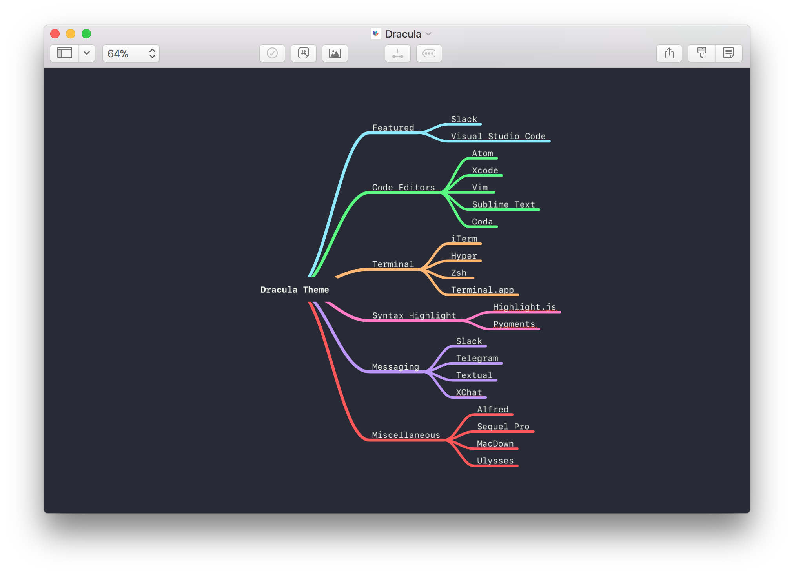

# Dracula for [MindNode](https://mindnode.com)

> A dark theme for [MindNode](https://mindnode.com).

## Install

All instructions can be found at [draculatheme.com/mindnode](https://draculatheme.com/mindnode).

## Team

This theme is maintained by the following person and a bunch of [awesome contributors](https://github.com/dracula/mindnode/graphs/contributors).

|  |
| ------------------------------------------------------------------------------------------------------------- |
| [Eivind Lindbråten](https://github.com/eivindml)                                                              |

## Community

- [Twitter](https://twitter.com/draculatheme) - Best for getting updates about themes and new stuff.
- [GitHub](https://github.com/dracula/dracula-theme/discussions) - Best for asking questions and discussing issues.
- [Discord](https://draculatheme.com/discord-invite) - Best for hanging out with the community.

## License

[MIT License](./LICENSE)
