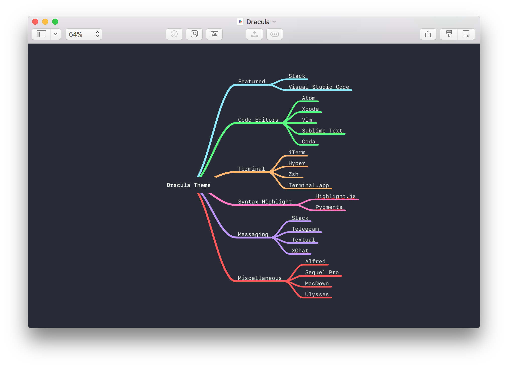

# Dracula for [MindNode](https://mindnode.com)

> A dark theme for [MindNode](https://mindnode.com).

## Install

Just double click the `dracula.mindnodetheme` to install the theme. The theme
is now available through the theme selector.

All instructions can be found at
[draculatheme.com/mindnode](https://draculatheme.com/mindnode).

## Team

This theme is maintained by the following person and a bunch of [awesome
contributors](https://github.com/dracula/template/graphs/contributors).

 | 
--- |
[Eivind Lindbråten](https://github.com/eivindml) | 

## License

[MIT License](./LICENSE)
